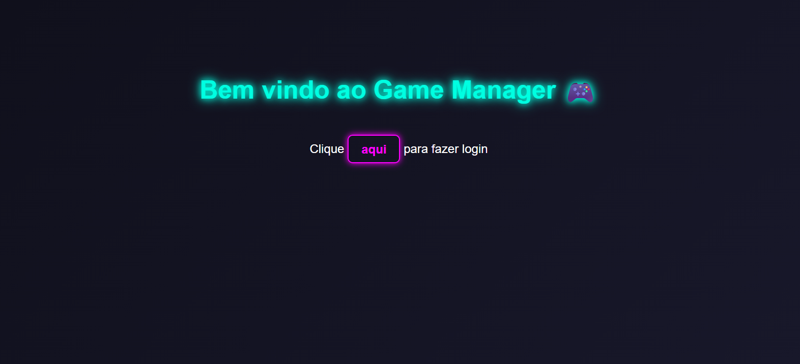
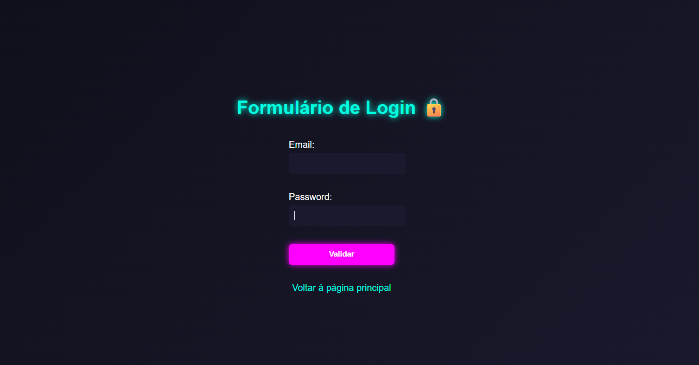
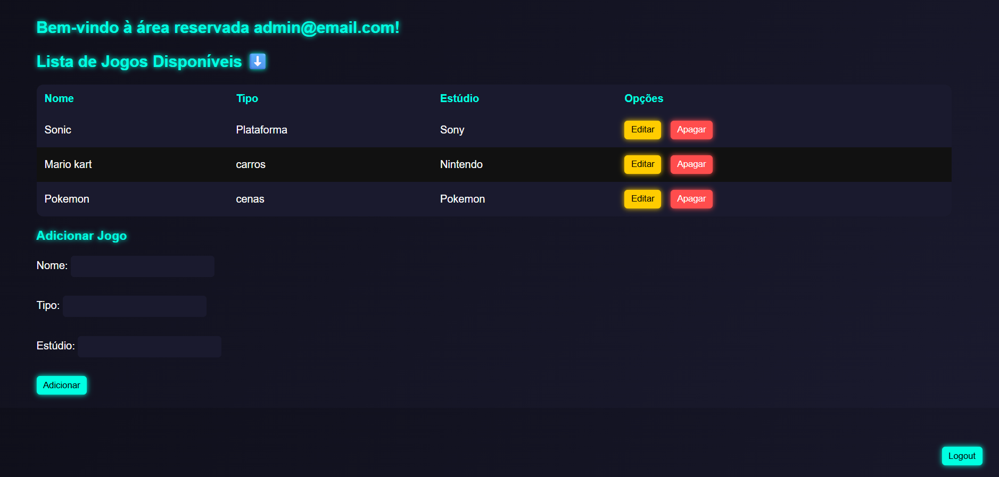
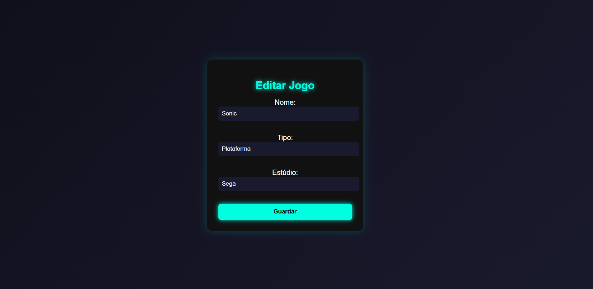

# 🎮 Game Management Web Application

## 📌 About the Project

This is an **academic Java web application** developed to practice and demonstrate concepts such as **JSP, Servlets, Hibernate ORM, sessions, and MySQL integration**.

The system simulates a simple game management platform where users can log in, view available games, manage them, and maintain a private session-based dashboard.

---

## ⚙️ Technologies Used

- Java (Servlets & JSP)
- Hibernate ORM
- MySQL Database
- HTML / CSS
- Apache Tomcat
- Jakarta EE

---

## 🔐 Main Features

###  Initial Page
- Welcome screen
- Login access point

###  Login System
- User authentication using email and password
- Session creation after successful login
- Error handling for invalid credentials

###  Game Management
- Displays list of registered games
- Add new games
- Edit existing games
- Delete games

###  Logout
- Ends user session
- Redirects back to the initial welcome page

---

## 🔄 Application Flow

1. User accesses the initial page
2. User logs in
3. System validates credentials using Hibernate
4. If valid:
   - Session is created
   - User is redirected to dashboard
5. User can manage games (CRUD operations)
6. User logs out and session is destroyed

---

## 🖼️ Screenshots

### Initial Page

### Login Page

### Dashboard

### Edit Game Page

---

##  Academic Purpose

This project was developed as part of an academic learning process to improve understanding of:

- Java Servlets architecture
- JSP dynamic pages
- Session management
- ORM with Hibernate
- Database integration (MySQL)
- Web application flow and structure (MVC concept)

